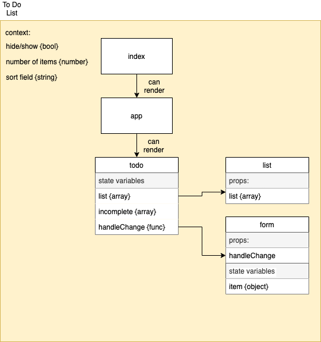

# todo

A todo list app using react context.

## 🚀 Getting Started

1. Install dependencies with `npm i` or `yarn i`
2. Run tests `npm test`
3. Start development server `npm start`

## 🏢 Architecture

## Phase 1

Style, modularize, and implement context

### Tasks

- [ ] Style with [Blueprint UI Kit](https://blueprintjs.com/docs/#blueprint)
- [ ] Modularize application
- [ ] Implement context API
  - manages number of items per page {int}
  - Hide or show completed items {bool}

## Further reading

[JSDoc – documentation](https://jsdoc.app/)
