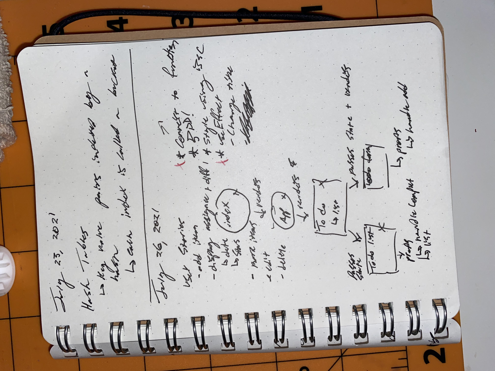

# todo

A todo list app using react context.

## 🚀 Getting Started

1. Install dependencies with `npm i` or `yarn i`
2. Run tests `npm test`
3. Start development server `npm start`

## 🏢 Architecture

<!--  -->

> `note`: new docs coming soon

## Further reading

[JSDoc – documentation](https://jsdoc.app/)
